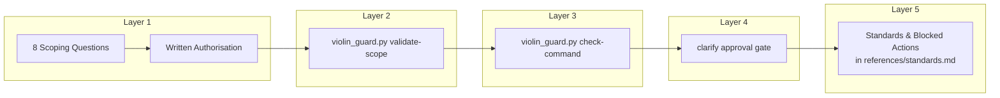

<p align="center">
  
</p>

<h1 align="center">Violin ☤ — Supervised Agentic Hermes Pentest Profile</h1>

<p align="center">
  <a href="https://github.com/Dan-StrategicAutomation/violin"></a>
  <a href="https://github.com/Dan-StrategicAutomation/violin/blob/main/LICENSE"></a>
  <a href="https://hermes-agent.nousresearch.com/">= 0.18.0"></a>
  <a href="https://www.kali.org/"></a>
  <a href="https://www.parrotsec.org/"></a>
</p>

<p align="center">
  <b>31 playbooks · 8 references · 0 plugins · 0 brokers · 100% Hermes built-in tools</b>
</p>

Violin is a **pluginless Hermes Agent profile** for supervised, authorised penetration tests — from reconnaissance through safe exploit validation to reporting. It uses only Hermes' built-in toolsets, skill-based playbooks, and lightweight guard scripts. No custom plugin code, no broker service, no external orchestrator.

```
hermes profile install https://github.com/Dan-StrategicAutomation/violin
hermes -p violin
```

---

## Features

<table>
<tr><td width="280"><b>🔬 31 Methodology Playbooks</b></td><td>7 phase playbooks (scoping → recon → exploitation → reporting) + 24 per-vulnerability-class playbooks covering OWASP Top 10, OWASP API Top 10, LLM Top 10, and beyond.</td></tr>
<tr><td><b>🛡️ Multi-Layer Safety</b></td><td>Interactive scoping (8 questions) → scope validation → machine guard check → user approval gates — every target-touching command is validated before execution.</td></tr>
<tr><td><b>🧠 Autonomous Tool Discovery</b></td><td>Detects installed tools, searches alternatives, reads docs, and asks to install what's missing. Never silently skips a step.</td></tr>
<tr><td><b>🌐 Browser + Web Research</b></td><td>Browser toolset for website enumeration (login forms, dashboards, DOM inspection). Web toolset for CVE lookup, exploit search, and OSINT.</td></tr>
<tr><td><b>📋 Evidence-Driven Reporting</b></td><td>Reproducible evidence with screenshots, tool output, request/response pairs. Structured CVSS 3.1 scoring with L1–L4 severity levels.</td></tr>
<tr><td><b>🔗 Hermes-Native</b></td><td>Inherits your existing Hermes provider/model. No extra API keys, no per-profile credentials, no lock-in.</td></tr>
</table>

---

## Quick Start

```bash
# 1. Install the profile
hermes profile install https://github.com/Dan-StrategicAutomation/violin

# 2. Start a session
hermes -p violin

# 3. Let Violin ask 8 scoping questions, then run your test
> Run a pentest against example.com
```

<details>
<summary><b>Prerequisites</b></summary>

- **Hermes Agent >= 0.18.0** — installed and on your PATH
- **Hermes provider configured** — Violin inherits your normal Hermes provider/model. No Violin-specific API key required.
- **Kali Linux or Parrot OS recommended** — Docker Kali, WSL, macOS, Windows, and remote jump boxes also work (the scoping phase adapts to your environment).

</details>

<details>
<summary><b>Set as default profile</b></summary>

```bash
hermes profile use violin
```

Now every `hermes` session loads Violin automatically.

</details>

---

## Engagement Workflow

```mermaid
flowchart LR
    A["1. Scoping"] --> B["2. Recon"]
    B --> C["3. Vuln Research"]
    C --> D["4. Exploitation"]
    D --> E["5. Reporting"]
    E --> F["6. Retrospective"]
    
    A -.->|"clarify"| G("Approval Gate")
    B -.->|"guard check"| G
    C -.->|"guard check"| G
    D -.->|"clarify + guard"| G

    style A fill:#1a1a2e,stroke:#e94560,stroke-width:2px
    style B fill:#16213e,stroke:#0f3460,stroke-width:2px
    style C fill:#1a1a2e,stroke:#e94560,stroke-width:2px
    style D fill:#16213e,stroke:#0f3460,stroke-width:2px
    style E fill:#1a1a2e,stroke:#e94560,stroke-width:2px
    style F fill:#16213e,stroke:#0f3460,stroke-width:2px
    style G fill:#2d2d2d,stroke:#ffd700,stroke-width:2px
```



### What each phase does

<table>
<tr><th>Phase</th><th>Action</th><th>Safety Gate</th></tr>
<tr><td><b>1. Scoping</b></td><td>8 questions via <code>clarify</code> — target type, testing mode, risk tolerance, authorisation</td><td>User approval</td></tr>
<tr><td><b>2. Reconnaissance</b></td><td>Passive OSINT → tech detection → active scanning</td><td>Guard + approval</td></tr>
<tr><td><b>3. Vuln Research</b></td><td>CVE lookup, exploit search, attack surface analysis</td><td>Guard check</td></tr>
<tr><td><b>4. Exploitation</b></td><td>Safe PoC validation per vulnerability class</td><td>Guard + user approval</td></tr>
<tr><td><b>5. Reporting</b></td><td>Evidence compilation, CVSS scoring, remediation</td><td>—</td></tr>
<tr><td><b>6. Retrospective</b></td><td>Gap analysis, playbook coverage update</td><td>Mandatory</td></tr>
</table>

---

## Architecture

```mermaid
graph TB
    subgraph "Your Machine"
        HE["Hermes Agent"]
        VI["Violin Profile"]
        GUARD["violin_guard.py"]
    end
    
    subgraph "Violin Skills"
        SK["SKILL.md"]
        PB["31 Playbooks"]
        REF["8 References"]
        TEMP["2 Templates"]
    end
    
    subgraph "Hermes Built-in Tools"
        T["terminal"]
        W["web"]
        B["browser"]
        F["file"]
        CE["code_execution"]
        S["skills"]
        CL["clarify"]
        D["delegation"]
        V["vision"]
        TD["todo"]
    end
    
    LLM["Your LLM Provider"]
    
    HE -->|"hermes -p violin"| VI
    VI -->|"loads"| SK
    SK -->|"routes to"| PB
    PB -->|"uses"| T & W & B & F
    VI -->|"validates via"| GUARD
    HE -->|"calls"| T & W & B & F & CE & S & CL & D & V & TD
    HE -->|"inherits"| LLM
    
    style HE fill:#2d2d2d,stroke:#ffd700,stroke-width:2px
    style VI fill:#1a1a2e,stroke:#e94560,stroke-width:2px
    style GUARD fill:#16213e,stroke:#0f3460,stroke-width:2px
```



---

## Toolsets

<details>
<summary><b>10 pentest-relevant Hermes toolsets enabled</b></summary>

| # | Toolset | Purpose |
|---|---------|---------|
| 1 | `terminal` | Run pentest tools, discover tools, read docs |
| 2 | `web` | CVE research, exploit search, OSINT, tool discovery |
| 3 | `browser` | Website enumeration — forms, DOM, screenshots, link crawling |
| 4 | `file` | Evidence, reports, scope files |
| 5 | `code_execution` | Parse output, write custom exploit scripts |
| 6 | `skills` | Load pentest playbooks |
| 7 | `todo` | Track engagement phases and tasks |
| 8 | `clarify` | Ask user for approvals and decisions |
| 9 | `delegation` | Parallel recon and exploit development |
| 10 | `vision` | Screenshot analysis and visual evidence |

> **Note:** `hermes tools --summary` may show Hermes' internal `kanban` category even when no `kanban_*` tools are exposed. Violin's `config.yaml` intentionally enables only the 10 toolsets above.

</details>

<details>
<summary><b>Conversation & memory isolation</b></summary>

Violin is isolated by design:

- `memory.memory_enabled: false` — no global MEMORY.md recall/write
- `memory.user_profile_enabled: false` — no global USER.md access
- `session_search` is not enabled — cannot search unrelated chats
- Engagement continuity lives in project files (scope docs, evidence, notes, reports)
- Start a fresh Hermes conversation per engagement to keep boundaries clean

</details>

---

## Safety Model

<details>
<summary><b>Multi-layer safety architecture</b></summary>



- **Authorised testing only** — no probing before scoping is complete and scope is approved
- **Approval gates** — scope, active recon, and exploitation each require explicit user approval via `clarify`
- **Machine check** — every target-touching command runs through `violin_guard.py` before execution (exit code 0=allowed, 1=blocked, 2=review required)
- **Non-destructive by default** — exploitation limited to safe, reproducible PoC
- **Evidence-first** — every finding backed by reproducible tool output, screenshots, request/response pairs
- **Frameworks-grounded** — every action justifiable under PTES, OWASP WSTG, or NIST SP 800-115

The full policy for approval tiers, blocked actions, evidence handling, rate limits, and scope allowlists lives in `skills/pentest/references/standards.md`.

</details>

<details>
<summary><b>Blocked actions</b></summary>

| Action | Default Status |
|--------|---------------|
| Credential attacks (bruteforce, spraying) | ❌ Blocked — requires RoE carve-out |
| Social engineering (phishing, vishing) | ❌ Blocked |
| Post-exploitation beyond proof | ❌ Blocked |
| Persistence (backdoors, cron, services) | ❌ Blocked |
| Stealth / evasion (anti-forensics, log tampering) | ❌ Blocked |
| Malware deployment | ❌ Blocked |
| Destructive payloads (DROP TABLE, rm -rf) | ❌ Blocked |
| Data exfiltration | ❌ Blocked — minimal PoC evidence only |

</details>

---

## Playbook Library

<details>
<summary><b>7 core phase playbooks</b></summary>

| Phase | Playbook | Description |
|-------|----------|-------------|
| Scoping | `playbooks/scoping.md` | Scope definition, RoE, target validation |
| Reconnaissance | `playbooks/recon.md` | Passive & active recon, asset enumeration, tech detection |
| Vulnerability Research | `playbooks/vuln-research.md` | CVE lookup, manual analysis, tool scanning |
| Exploitation | `playbooks/exploitation.md` | PoC development, exploitation, evidence capture |
| Post-Exploitation | `playbooks/post-exploitation.md` | Limited: prove access extent, no lateral movement |
| Reporting | `playbooks/reporting.md` | Findings doc, risk rating, remediation, executive summary |
| Tools | `playbooks/tools.md` | Tool setup, discovery, and management |

</details>

<details>
<summary><b>24 per-vulnerability-class playbooks</b></summary>

| Vulnerability Class | Playbook | OWASP Mapping |
|---------------------|----------|---------------|
| SQL Injection (SQLi) | `playbooks/sqli.md` | A03:2021 — Injection |
| Cross-Site Scripting (XSS) | `playbooks/xss.md` | A03:2021 — Injection |
| Command Injection | `playbooks/command-injection.md` | A03:2021 — Injection |
| SSRF | `playbooks/ssrf.md` | A10:2021 — SSRF |
| Server-Side Template Injection | `playbooks/ssti.md` | A03:2021 — Injection |
| Path Traversal | `playbooks/path-traversal.md` | A01:2021 — Broken Access Control |
| IDOR / Access Control | `playbooks/idor-access-control.md` | A01:2021 |
| Authentication Bypass | `playbooks/auth-bypass.md` | A07:2021 — Auth Failures |
| JWT Attacks | `playbooks/jwt-attacks.md` | A07:2021 — Auth Failures |
| Insecure Deserialization | `playbooks/deserialization.md` | A08:2021 — Integrity Failures |
| XML External Entities (XXE) | `playbooks/xxe.md` | A05:2021 — Security Misconfig |
| NoSQL Injection | `playbooks/nosql-injection.md` | A03:2021 — Injection |
| LLM Prompt Injection | `playbooks/llm-prompt-injection.md` | OWASP LLM Top 10 |
| Business Logic Flaws | `playbooks/business-logic.md` | A04:2021 — Insecure Design |
| API Security | `playbooks/api-security.md` | OWASP API Top 10 |
| Input Validation | `playbooks/input-validation.md` | A04:2021 — Insecure Design |
| Cryptographic Issues | `playbooks/cryptographic-issues.md` | A02:2021 — Crypto Failures |
| Security Misconfiguration | `playbooks/security-misconfiguration.md` | A05:2021 — Security Misconfig |
| Security Through Obscurity | `playbooks/security-through-obscurity.md` | A05:2021 — Security Misconfig |
| Unvalidated Redirects | `playbooks/redirects-unvalidated.md` | A01:2021 — Broken Access Control |
| Anti-Automation | `playbooks/anti-automation.md` | OWASP Automated Threats |
| Observability Failures | `playbooks/observability-failures.md` | A09:2021 — Logging Failures |
| Supply Chain | `playbooks/supply-chain.md` | A06:2021 — Vulnerable Components |
| CSRF | `playbooks/csrf.md` | A01:2021 — Broken Access Control |

</details>

<details>
<summary><b>8 reference documents</b></summary>

| Reference | Path |
|-----------|------|
| Methodology (PTES/OWASP/NIST) | `references/methodology.md` |
| CVE Research APIs | `references/cve-apis.md` |
| Tool Discovery | `references/tool-discovery.md` |
| Tool Catalog | `references/tool-catalog.md` |
| Kali/Parrot Tool Paths | `references/kali-parrot-paths.md` |
| Operational Standards | `references/standards.md` |
| Retrospective | `references/retrospective.md` |
| Real-World Coverage Matrix | `references/real-world-coverage-matrix-template.yaml` |

</details>

<details>
<summary><b>2 templates</b></summary>

| Template | Path |
|----------|------|
| Scope Document (YAML) | `templates/scope-template.yaml` |
| Pentest Report (Markdown) | `templates/report-template.md` |

</details>

---

## Repository Layout

```
violin/
├── .hermes.md              # Project-level agent context
├── SOUL.md                 # Agent identity — senior pentester persona
├── config.yaml             # Profile config (toolsets, safety, memory)
├── distribution.yaml       # Hermes distribution manifest
├── LICENSE                 # MIT License
├── README.md               # This file
├── assets/                 # Brand assets (logo)
├── scripts/                # Guard & smoke tests
│   ├── violin_guard.py     # Scope, command & release validation
│   ├── smoke-test.sh       # Kali/Parrot release smoke
│   ├── smoke-test.ps1      # Windows supplemental smoke
│   └── kali.sh             # Docker Kali helper
└── skills/pentest/         # Pentest methodology
    ├── SKILL.md            # Orchestrator skill
    ├── playbooks/          # 31 playbooks
    ├── references/         # 8 reference documents
    └── templates/          # 2 templates (scope, report)
```

---

## Release Verification

```bash
# Run all release checks
python scripts/violin_guard.py check-release

# Or use the smoke tests
./scripts/smoke-test.sh --no-install          # Linux/macOS
.\scripts\smoke-test.ps1 -NoHermes            # Windows
```

The guard check validates: YAML structure, 31 playbooks present, required sections present, no stale evidence paths, all markdown references resolve, distribution manifest covers all owned files.

---

## Optional: Kali Docker Container

<details>
<summary><b>One-time setup for a full Kali toolchain on any OS</b></summary>

```bash
# Create the container
docker pull kalilinux/kali-rolling
docker create -it --name kali-pentest \
  -v /path/to/violin/engagements:/engagements \
  kalilinux/kali-rolling bash
docker start kali-pentest

# Install tools (~600 packages, 5-10 min)
docker exec kali-pentest apt update
docker exec kali-pentest apt install -y kali-linux-headless

# Verify
docker exec kali-pentest nmap --version
```

Use `scripts/kali.sh` as shorthand: `kali nmap -sV target.com` instead of `docker exec kali-pentest nmap -sV target.com`.

</details>

---

## Optional MCP Servers

<details>
<summary><b>Enhance Violin with community MCP servers</b></summary>

| MCP Server | Install | Purpose |
|-----------|---------|---------|
| `onlinecybertools-mcp-server` | `npx -y onlinecybertools-mcp-server` | 280+ OSINT/recon tools — whois, SSL check, JWT decode, network diag, hashes |
| `runyourempire/4DA` | `npx -y @runyourempire/4DA` | Live CVE scanning, dependency health, upgrade planning |

Add them to `config.yaml` under `mcp_servers:` after install. See [Hermes MCP docs](https://hermes-agent.nousresearch.com/docs/user-guide/features/mcp).

</details>

---

## Contributing

See [CONTRIBUTING.md](CONTRIBUTING.md) for development setup, PR process, and code style.

## Security

See [SECURITY.md](SECURITY.md) for reporting vulnerabilities.

---

## License

MIT — see [LICENSE](LICENSE).