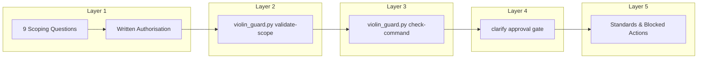

<p align="center">
  
</p>

<h1 align="center">Violin ☤ — Supervised Agentic Hermes Pentest Profile</h1>

<p align="center">
  <a href="https://github.com/Strategic-Automation/violin"></a>
  <a href="https://github.com/Strategic-Automation/violin/blob/master/LICENSE"></a>
  <a href="https://hermes-agent.nousresearch.com/">= 0.18.0"></a>
  <a href="https://www.kali.org/"></a>
  <a href="https://www.parrotsec.org/"></a>
</p>

<p align="center">
  <b>31 playbooks · 10 references · 11 templates · required execution guard · Hermes-native</b>
</p>

Violin is a **Hermes-native agentic pentest profile** for supervised, authorised penetration tests — from reconnaissance through safe exploit validation to reporting. It uses Hermes' built-in toolsets, three routed skills, and the required `violin-guard` plugin at the target-execution boundary. The standalone CLI supports release checks, diagnostics, and administrative recovery; target commands run through the plugin. Violin adds no profile-specific credentials and inherits the provider and tool backends already configured in Hermes.

```
hermes profile install https://github.com/Strategic-Automation/violin
hermes -p violin
```

---

## Features

<table>
<tr><td width="280"><b>🔬 31 Methodology Playbooks</b></td><td>7 operational playbooks (five execution phases, optional post-exploitation, and the tools catalog) + 24 vulnerability-class playbooks, routed across the `pentest`, `web-attacks`, and `access-control` skills.</td></tr>
<tr><td><b>🛡️ Multi-Layer Safety</b></td><td>Interactive scoping (9 questions) → scope validation → guard check → approval gates — every target-touching command validated before execution.</td></tr>
<tr><td><b>🧠 Pentesting Task Tree</b></td><td>Structured artifact tracking every task via `[x]/[ ]/[~]` markers across phases, with executor-owned history, hypothesis linking, and guard-bound batch reviews.</td></tr>
<tr><td><b>🌐 Browser + Web Research</b></td><td>Browser toolset for website enumeration. Web toolset for CVE lookup, exploit search, and OSINT.</td></tr>
<tr><td><b>📋 Evidence-Driven Reporting</b></td><td>Reproducible evidence with screenshots, tool output, and request/response pairs. CVSS 3.1 + 4.0 crosswalks and optional remediation patches.</td></tr>
<tr><td><b>🔗 Hermes-Native</b></td><td>Inherits your existing Hermes provider, model, and tool backends. Violin introduces no separate credential store or broker.</td></tr>
</table>

---

## Quick Start

```bash
# 1. Install the profile
hermes profile install https://github.com/Strategic-Automation/violin

# 2. Start a session
hermes -p violin

# 3. Let Violin ask scoping questions, then run your test
> Run a pentest against example.com
```

<details>
<summary><b>Prerequisites</b></summary>

- **Hermes Agent >= 0.18.0** — installed and on your PATH
- **Hermes provider configured** — Violin inherits your normal Hermes provider/model
- **Kali Linux or Parrot OS** — the primary execution environments; Docker Kali is the supported fallback when the host lacks pentest tools
- **Optional web/browser backend** — required only for Hermes web or browser capabilities; Violin does not add separate API credentials

</details>

<details>
<summary><b>Set as default profile</b></summary>

```bash
hermes profile use violin
```

</details>

---

## Engagement Workflow

```mermaid
flowchart LR
    A["1. Scoping"] --> B["2. Recon"]
    B --> C["3. Vuln Research"]
    C --> D["4. Exploitation"]
    D --> E["5. Reporting"]
    E --> F["6. Retrospective"]
    
    A -.->|"clarify"| G("Approval Gate")
    B -.->|"guard check"| G
    C -.->|"guard check"| G
    D -.->|"clarify + guard"| G

    style A fill:#1a1a2e,stroke:#e94560,stroke-width:2px
    style B fill:#16213e,stroke:#0f3460,stroke-width:2px
    style C fill:#1a1a2e,stroke:#e94560,stroke-width:2px
    style D fill:#16213e,stroke:#0f3460,stroke-width:2px
    style E fill:#1a1a2e,stroke:#e94560,stroke-width:2px
    style F fill:#16213e,stroke:#0f3460,stroke-width:2px
    style G fill:#2d2d2d,stroke:#ffd700,stroke-width:2px
```



| Phase | Action | Safety Gate |
|-------|--------|-------------|
| **1. Scoping** | 9 questions via `clarify` | User approval |
| **2. Reconnaissance** | Passive OSINT → tech detection → active scanning | Guard + approval |
| **3. Vuln Research** | CVE lookup, exploit search, attack surface analysis | Guard check |
| **4. Exploitation** | Safe PoC validation per vulnerability class | Guard + user approval |
| **5. Reporting** | Evidence compilation, CVSS scoring, remediation | — |
| **6. Retrospective** | Gap analysis, playbook coverage update | Mandatory |

---

## Architecture

```mermaid
graph TB
    subgraph "Your Machine"
        HE["Hermes Agent"]
        VI["Violin Profile"]
        GUARD["violin_guard execution + evidence"]
    end
    
    subgraph "Violin Skills"
        SK["pentest orchestrator"]
        WEB["web-attacks skill"]
        AC["access-control skill"]
        PB["31 Playbooks"]
        REF["10 References"]
        TEMP["11 Templates"]
    end
    
    subgraph "Configured Toolsets"
        T["terminal"]
        W["web"]
        B["browser"]
        F["file"]
        CE["code_execution"]
        S["skills"]
        CL["clarify"]
        D["delegation"]
        V["vision"]
        TD["todo"]
        VG["violin_guard"]
    end
    
    LLM["Your LLM Provider"]
    
    HE -->|"hermes -p violin"| VI
    VI -->|"loads"| SK
    VI -->|"requires"| GUARD
    SK -->|"routes to"| WEB & AC & PB
    WEB --> PB
    AC --> PB
    SK --> REF & TEMP
    HE -->|"calls"| T & W & B & F & CE & S & CL & D & V & TD & VG
    HE -->|"inherits"| LLM

    style HE fill:#2d2d2d,stroke:#ffd700,stroke-width:2px
    style VI fill:#1a1a2e,stroke:#e94560,stroke-width:2px
    style GUARD fill:#16213e,stroke:#0f3460,stroke-width:2px
```



### Enabled Toolsets

11 toolsets configured in `config.yaml` (`platform_toolsets.cli`): 10 built-in — `terminal`, `web`, `browser`, `file`, `code_execution`, `skills`, `todo`, `clarify`, `delegation`, `vision` — plus the `violin_guard` guard-plugin toolset.

### Conversation & Memory Isolation

- `memory.memory_enabled: false` — no global memory recall/write
- `memory.user_profile_enabled: false` — no global user profile access
- Engagement continuity lives in project files (scope docs, evidence, reports)
- Keep one Hermes conversation per engagement; after compression, resume in that conversation from `$ENG_DIR/state/`

---

## Safety Model



- **Authorised testing only** — no probing before scoping is complete
- **Approval gates** — scope, active recon, and exploitation each require explicit user approval
- **Guard check** — every target-touching command validated through `violin_exec` or another typed guard tool; Violin's `pre_tool_call` plugin hook blocks clearly target-touching raw `terminal` calls before execution. The CLI exposes the same check for diagnostics (exit 0=allowed, 1=blocked, 2=review)
- **Non-destructive by default** — exploitation limited to safe, reproducible PoC
- **Evidence-first** — every finding backed by reproducible tool output, screenshots, request/response pairs
- **Exploit-first validation** — no hypothesis advances to Validated without a verification command
- **Stateful recovery** — phase summaries and checkpoints restore the current engagement after context compression without starting a new conversation

Full safety policy: `skills/pentest/references/standards.md`. Forbidden actions: `.hermes.md` §Forbidden Behaviour.

---

## Repository Layout

```
violin/
├── .hermes.md              # Project-level agent context
├── SOUL.md                 # Agent identity — senior pentester persona
├── config.yaml             # Profile config (toolsets, safety, memory)
├── distribution.yaml       # Hermes distribution manifest
├── plugins/violin_guard/   # Required Hermes guard plugin and execution boundary
│   ├── terminal_policy.py  # Best-effort blocks for clearly target-touching raw terminal calls
│   └── code_execution_audit.py # Engagement audit contract for execute_code
├── scripts/                # CLI and release smoke helpers
│   ├── violin_guard.py     # Diagnostic/admin CLI over the plugin modules
│   ├── smoke-test.sh       # Linux/macOS release smoke
│   ├── smoke-test.ps1      # Windows supplemental smoke
│   └── kali.sh             # Docker Kali helper
└── skills/
    ├── pentest/            # Orchestrator, workflow, shared policy, and templates
    │   ├── SKILL.md
    │   ├── playbooks/      # 23 operational and vulnerability-class playbooks
    │   ├── references/     # 10 reference files
    │   └── templates/      # 11 engagement, evidence, and methodology helpers
    ├── web-attacks/        # Routed skill + 5 injection/web playbooks
    └── access-control/     # Routed skill + 3 authentication/authorisation playbooks
```

---

## Release Verification

```bash
python scripts/violin_guard.py check-release
```

Validates the plugin manifest and registered tools, isolated Hermes-style plugin import, stale skill references, Ruff, and the full pytest suite.

---

## Optional: Kali Docker Container

<details>
<summary><b>One-time setup for a full Kali toolchain on any OS</b></summary>

See [`scripts/kali.sh`](scripts/kali.sh) for the container exec helper.

```bash
docker pull kalilinux/kali-rolling
docker create -it --name kali-pentest \
  -v /path/to/violin/engagements:/engagements \
  kalilinux/kali-rolling bash
docker start kali-pentest
docker exec kali-pentest apt update
docker exec kali-pentest apt install -y kali-linux-headless
```

</details>

## Contributing

See [CONTRIBUTING.md](CONTRIBUTING.md) for development setup, PR process, and code style.

## Security

See [SECURITY.md](SECURITY.md) for reporting vulnerabilities.

---

## License

MIT — see [LICENSE](LICENSE).
