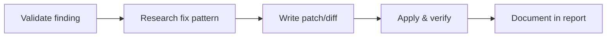

# Exploitation Playbook

> **📁 Project structure:** All exploitation evidence goes under `engagements/<target-name>-<YYYY-MM-DD>/evidence/exploitation/`.
> ```bash
> ENG_DIR="engagements/<target>-$(date +%F)"
> mkdir -p "$ENG_DIR/evidence/exploitation"
> ```

## Capabilities (this phase)

| Tool | Purpose (exploitation phase) |
|------|------------------------------|
| `terminal` | Run exploits, sqlmap, metasploit, curl PoC payloads |
| `web_search` | Research exploitation techniques, bypass methods, PoC code |
| `browser` | Verify XSS, DOM-based exploits, interactive payload testing |
| `write_file` / `read_file` | Save exploit evidence, read vuln research and recon context |
| `code_execution` | Write and test custom exploit scripts |
| `clarify` | Get per-exploit approval (required before EVERY attempt) |
| `todo` | Map exploitation tasks to PTT and hypothesis IDs |

> ⚠️ **Exploit-first validation:** Do NOT mark a hypothesis as Validated without running a verification command that proves exploitability. No PoC = finding stays at Likely.
>
> ⚠️ **No exploitation without documented approval from engagement lead.**

---

## Exploit Validation Policy

Every finding must pass exploit-first validation before moving from Likely to Validated.

### Validation Gate

Before any hypothesis can transition to **Validated**, a verification command must prove exploitability:

```bash
# Run a verification command that proves the vulnerability exists
# Example: SQLi time-based blind
sqlmap -u 'https://target.com/page?id=1' --batch --current-db --no-cast --time-sec=2
```

### Acceptance Criteria

| Finding State | Criteria | Actions Required |
|---------------|----------|-----------------|
| **Likely → Validated** | Evidence file exists with exact command, output, and timestamp | Document finding in PTT (`[x]`), link evidence path, update hypotheses.md |
| **Likely → Rejected** | Verification command produced no confirming evidence | Log negative result, update hypotheses.md, record in PTT (`[-]`) |
| **Candidate → Likely** | Partial evidence (timing diff, error message, differing response) | Knowledge gap identified; add next-step to hypothesis |

### Validation Evidence Format

Every validated finding must include a minimal, reproducible verification snippet:

```yaml
finding_id: FIND-001
hypothesis_id: H-001
vuln_class: SQLi
command: sqlmap -u 'https://target.com/page?id=1' --batch --current-db
output: "current database: 'target_db'"
evidence_path: $ENG_DIR/evidence/exploitation/sqli/find001-verification.txt
timestamp: <YYYY-MM-DD HH:MM>
validated_by: exploit-first run
```

### When Validation Fails

- **No confirming evidence:** Stay at Likely. Add a note to the hypothesis about what was attempted and what would constitute proof.
- **Partial confirmation** (timing diff but no data): Escalate to Likely with clear next-step instructions.
- **Negative/contradictory evidence:** Move to Rejected. Include the counter-evidence in the research log.

> 🚫 **No hypothesis advances to Validated without a verification command and saved evidence. This is not negotiable.**

---

Before every exploitation step, announce what you are about to do and why. See `templates/transparency-boilerplate.md` for the full pattern. Adapt examples to the exploitation phase: include target endpoint, vulnerability class, exact technique, expected outcome, evidence path, and a statement confirming the exploit is non-destructive and reversible. Wait for acknowledgment before executing. Exploitation already requires explicit approval via `clarify` (see below) — make the transparency announcement before the approval request.

## Approval Required

Before **any** exploitation activity, obtain explicit approval via `clarify`. The approval request **must** include:

| Field | Description |
|-------|-------------|
| **Target** | Specific host, endpoint, or resource to be exploited |
| **Vulnerability** | The confirmed or suspected vulnerability class and identifier |
| **Method** | Exact exploitation technique and tooling to be used |
| **Expected Outcome** | What proof will be collected (e.g., time-based response, file read) |
| **Non-destructive & Reversible** | Confirm the exploit causes no side effects, data modification, or service disruption |

> **⚠️ No exploitation begins without a documented approval from the engagement lead or client point of contact.**

---

## Exploitation Methodology

### 1. Review the Vulnerability

Before attempting any exploit, thoroughly understand the vulnerability:

- **Class identification**: Map to OWASP Top 10 and CWE (e.g., CWE-89: SQL Injection, CWE-79: XSS)
- **CVSS scoring**: Calculate or reference the CVSS v3.1 score (vector string + base score)
- **Internet research**: Search for exploitation guides, walkthroughs, and writeups specific to the vulnerability class and target technology stack

### 2. Research Exploitation Approach

Gather practical exploitation resources:

- **Web search**: Find current exploitation techniques and payload variations
- **GitHub PoC code**: Locate proof-of-concept implementations; review for safety and correctness
- **HackerOne reports**: Review disclosed reports for real-world exploitation patterns
- **Blog posts / advisories**: Check vendor advisories, security blogs, and exploit databases
- **Tooling**: If a dedicated tool exists (e.g., sqlmap, jwt_tool, ysoserial), suggest installing it via `clarify` before continuing

### 3. Prepare the Exploit

- **Review code thoroughly**: Inspect any PoC or exploit script for destructive side effects, hardcoded IPs, or unsafe operations
- **Modify for non-destructive proof**: Adapt payloads to produce evidence without modifying data, deleting resources, or causing denial of service
- **Stage in isolated environment**: If possible, test the exploit payload in a controlled environment first
- **Prepare evidence collection**: Set up command output capture (`tee`, file redirection, or terminal logging)

### 4. Execute

- Run the exploit with the approved target and parameters
- Collect all command output, response data, and timing information as evidence
- Verify the exploit works as expected — if the result is inconclusive, do not retry without re-approval
- Log the exact command used, the output received, and any relevant contextual information (timestamp, request/response headers, etc.)

### 5. Document Finding

For each validated finding, document:

| Element | Description |
|---------|-------------|
| **Title** | Clear, descriptive finding name |
| **Severity** | Critical / High / Medium / Low / Info |
| **CVE** | CVE identifier (if applicable) |
| **Description** | Detailed description of the vulnerability and how it was exploited |
| **Evidence** | Raw command executed and its output (redacted where necessary) |
| **Impact** | Business and technical impact of the vulnerability |
| **Remediation** | Specific, actionable remediation recommendations |

---

## Common Exploitation Patterns

These patterns serve as quick-reference templates. For detailed per-class playbooks, reference the relevant playbook in this directory.

### SQL Injection (SQLi)
```
sqlmap --risk=1 --level=1 --batch --read-only --no-cast --no-dump --technique=BEUSTQ --url "<target>"
```
- `--risk=1 --level=1`: Minimal, safe test payloads only
- `--batch`: Non-interactive
- `--read-only`: **Mandatory** — no data modification
- `--no-dump`: Do not dump database contents in MVP
- `--technique=BEUSTQ`: Test all techniques (Boolean, Error, Union, Stacked, Time, Query)
- **Reference**: See `sqli.md` playbook for detailed methodology

### Cross-Site Scripting (XSS)
- **Manual testing only** — no automated scanners in MVP
- **Reflected XSS only** — stored/persistent XSS requires separate approval
- Payloads should be non-destructive proof-of-concept (e.g., `alert(document.domain)`)
- **Reference**: See `xss.md` playbook for payload lists and context-specific bypasses

### Command Injection
```
; sleep 5
```
- Use time-based detection (`sleep 5`, `ping -c 5 127.0.0.1`) for blind injection
- For visible injection, use benign commands like `id` or `whoami` — do **not** execute destructive commands
- **Reference**: See `command-injection.md` playbook for filter bypass techniques

### Server-Side Request Forgery (SSRF)
```
curl http://169.254.169.254/latest/meta-data/
```
- Target read-only internal resources (metadata endpoints, internal APIs)
- Do not attempt to write data or trigger internal state changes
- **Reference**: See `ssrf.md` playbook for cloud metadata endpoints and internal network discovery

### Path Traversal
```
curl "http://<target>/../../../etc/passwd"
```
- Read-only: only attempt to read files, never write
- Use `../../../etc/passwd` on Linux or `../../../windows/win.ini` on Windows
- **Reference**: See `path-traversal.md` playbook for encoding bypasses and filter evasion

### Insecure Direct Object Reference (IDOR)
```
curl "http://<target>/api/users/12345/profile"
```
- Read-only access to other users' resources — do not modify or delete
- Enumerate sequential IDs or predictable patterns only
- **Reference**: See `idor-access-control.md` playbook for parameter fuzzing and authorization testing

### JWT (JSON Web Token) Attacks
- Test algorithm confusion (`alg: none`, `alg: HS256` with public key as HMAC secret)
- Check for expired tokens, weak signing keys, and missing signature verification
- **Reference**: See `jwt-attacks.md` playbook for detailed testing matrix

### Deserialization Attacks
- Non-destructive proof only — demonstrate deserialization is possible without executing arbitrary commands
- Use `ysoserial` with safe gadget chains where available
- **Reference**: See `deserialization.md` playbook for chain selection and detection

### XML External Entity (XXE) Injection
- File read proof only — read a single benign file (e.g., `/etc/hostname`, `/etc/passwd`)
- Do not attempt SSRF, blind exfiltration, or denial of service
- **Reference**: See `xxe.md` playbook for payload templates and entity encoding

---

## Finding States

Every finding progresses through a defined lifecycle of states:

| State | Description |
|-------|-------------|
| **Candidate** | A plausible vulnerability identified but not yet proven with any evidence |
| **Likely** | Evidence suggests the vulnerability exists (e.g., time delay, error message, differing responses) but not fully confirmed |
| **Validated** | Vulnerability is confirmed with a working proof-of-concept and documented evidence |
| **Rejected** | Attempted validation produced no evidence — the candidate is marked as a false positive |

**State transitions:**

```
Candidate ──► Likely ──► Validated
   │                      │
   └──────── Rejected ────┘
```

---

## Hypothesis Tracking in Exploitation

Every exploitation attempt is driven by a hypothesis from the board
(`$ENG_DIR/hypotheses.md`). See SKILL.md §8 for board structure and lifecycle.

**Before each attempt:** read the board to find theories at Likely status,
read back evidence to avoid redundant attempts, confirm the hypothesis has a
clear rationale and expected outcome.

**After each attempt:** update hypothesis status (Likely→Validated or Rejected),
link the evidence file path, record in Resolved Theories if resolved, and
create new linked hypotheses if the result suggests new theories.

**Before context compression:** persist all active theories with current status
and next steps. After resume, `read_file` the board before any new tool batch.

**When a hypothesis reaches Validated**, create a finding entry and link it:
`H-001 → FIND-001` with evidence path.

---

## Chain Exploits

**Do NOT automatically chain vulnerabilities.** Each step in a multi-step exploit requires a new approval via `clarify`.

Example: If you find SSRF that reveals an internal admin panel, and that panel has an IDOR vulnerability, you must:
1. Document the SSRF finding first (state: Validated)
2. Seek new approval via `clarify` for the IDOR exploitation against the internal admin panel
3. Only proceed after receiving explicit approval

---

## Auto-Patch Loop

After validating a finding, attempt to generate and apply a fix. This closes the detection→remediation loop.

### Workflow



### 1. Research Fix Pattern

For the vulnerability class, determine the canonical fix:

| Vuln Class | Fix Pattern |
|------------|-------------|
| SQLi | Parameterized query / prepared statement |
| XSS | Output encoding + CSP header |
| Command Injection | Avoid shell invocation; use parameterized process API |
| SSRF | URL allowlist + disable redirect following |
| Path Traversal | Validate path against allowed base directory |
| IDOR | Server-side ownership check on every object access |
| JWT | Validate algorithm whitelist; use RS256/ES256 |

### 2. Write the Fix

Use `write_file` to generate a patch against the vulnerable code:

```bash
# Example: SQLi fix patch
write_file path="$ENG_DIR/evidence/exploitation/<finding>/fix.patch" content="
--- a/src/user_api.php
+++ b/src/user_api.php
@@ -10,7 +10,7 @@
-function getUser($id) {
-    $query = \"SELECT * FROM users WHERE id = $id\";
+function getUser($id) {
+    $stmt = $db->prepare(\"SELECT * FROM users WHERE id = ?\");
+    $stmt->execute([$id]);
"
```

### 3. Apply & Re-Verify

```bash
# Apply the fix (ask approval first via clarify)
cd /path/to/target/source
git apply "$ENG_DIR/evidence/exploitation/<finding>/fix.patch"

# Re-run the verification command — should now fail
sqlmap -u 'https://target.com/page?id=1' --batch --current-db --no-cast --time-sec=2
# Expected: "all tested parameters do not appear to be injectable"
```

### 4. Document

- Record the fix path in the finding record
- Attach the patch file as evidence
- Include in the report's remediation section

> 🔧 **Auto-patch is optional.** Only attempt fixes when (a) you have access to the source code, (b) the user approves, and (c) you can verify the fix doesn't break functionality. In black-box engagements, skip auto-patch.

---

## Preconditions / Scope Gate

- Vulnerability research phase complete with validated findings
- Exploitation approval obtained via clarify
- Scope document (scope.yaml) permits exploitation

## Stop Conditions

- Finding escalates beyond agreed risk level → pause and escalate
- Exploitation affects production stability → cease immediately
- Credentials or sensitive data discovered that exceed proof scope → pause and notify

## Blocked Actions

- Exploitation without documented approval
- Chaining exploits without separate re-approval for each step
- Destructive or persistent payloads without explicit client authorization

---

## Blocked Behaviour

See `.hermes.md` "Forbidden Behaviour" for the full blocked list. Any deviation
requires written approval from the client and engagement lead, documented in the
test plan before execution.